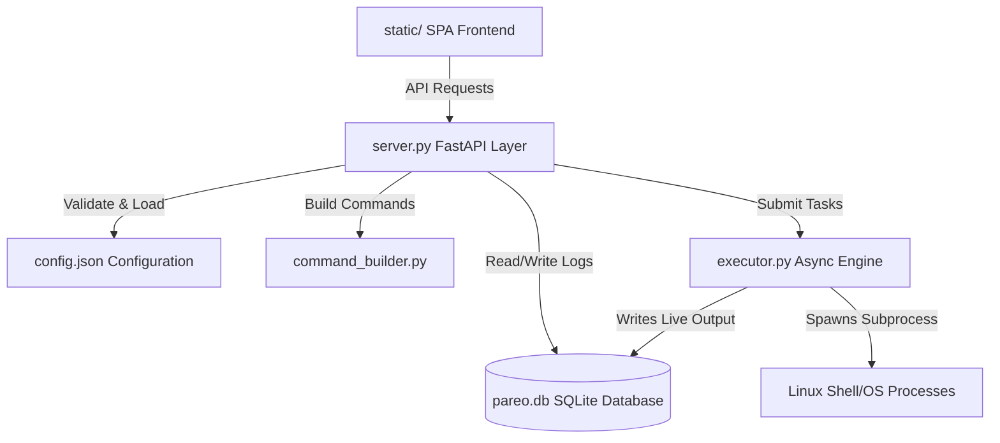

# Pareo - Configuration-Driven Command Execution & Orchestration Engine

**Pareo** (Latin for *"I obey"* or *"I am obedient"*) is a lightweight, modular, and configuration-driven Single Page Application (SPA) utility designed to queue, execute, and monitor system-level commands and orchestrate tasks over a Local Area Network (LAN).

With a robust FastAPI backend, a thread-safe SQLite-backed state machine, and a vanilla HTML/JS frontend, Pareo allows you to safely delegate heavy tasks (like media conversion and batch file transfers) to a dedicated home server or local machine without CPU/RAM overload or browser blocking.

---

## 🚀 Key Features

### 1. Multi-Queue Task Engine
Rather than running everything in a single queue, Pareo implements a concurrent **Multi-Queue Async Executor** (`executor.py`) with four dedicated channels:
*   🎥 **`media`**: Sequentially processes heavy video/audio rendering workloads (e.g., FFMPEG).
*   📁 **`fs`**: Manages file system operations like copying, moving, deleting, and compressing files.
*   🌐 **`network`**: Handles downloads and external data requests (e.g., Torrent Downloader via `aria2c`).
*   ⚙️ **`default`**: A fallback channel for generic operations and retried tasks.

Tasks within each queue run sequentially to protect hardware resources, while separate queues process tasks concurrently (e.g., a file compression job will not block a torrent download).

### 2. State & Recovery Machine
*   **SQLite Logging & State Database (`pareo.db`):** Task states, execution metrics, and real-time terminal stdout/stderr outputs are saved persistently in SQLite.
*   **Orphan Recovery:** On server boot, any task left in a "Running" state (due to abrupt server termination or power outage) is marked as `Failed (Interrupted)`, and all unresolved `Pending` tasks are automatically restored and re-queued.
*   **Interactive Task Retry:** Failed or interrupted tasks can be retried directly from the UI, resetting their logs and queueing them back into the execution flow.

### 3. Interactive Utilities & Switchboard
*   **System Switchboard:** A physical-like grid of immediate execution buttons (e.g., check server uptime, check disk usage, start/stop a VPN). Supports:
    *   *Standard Execution:* Runs the shell command and displays the terminal output directly in an overlay modal.
    *   *Detached Execution:* Spawns an independent OS process (fire-and-forget) that runs in a new session without blocking the engine or logging outputs.
*   **Generic Task Cards:** Templated inputs defined in `config.json` that render customized forms in the UI. When submitted, they resolve inputs into template variables, compile the final command, and route them to their designated execution queue.

### 4. Interactive File Manager & Bookmarks
*   **Directory Browser:** A modal-based explorer that communicates with local/remote nodes.
*   **Bookmarks & Auto-complete:** Paths configured in `config.json` are exposed to the UI as suggestions to simplify path entry.
*   **Configurable Batch Actions:** Perform commands (Copy, Move, Compress, etc.) on multiple selected files. The interface dynamically reads `config.json` to show/hide destination inputs depending on the requirements of the selected action.

### 5. Local Process Monitor
*   **Independent Daemon Control:** Start, stop, or force-kill server processes configured in `config.json`. Spawns processes in a detached session (`start_new_session=True`) to run independently of Pareo.
*   **Port & Process Status:** Inspects listening sockets (`lsof` or `ss`) to verify status, adopt running PIDs, and retrieve details, ensuring the UI remains perfectly in sync without memory state dependency.
*   **Live Log Streaming:** Access and refresh live console tailing files directly from the UI logs modal overlay.

---

## 🏗️ System Architecture

Pareo relies on a strict separation of concerns to guarantee stability:



1.  **The Pipeline Schema (`config.json`):** The single source of truth defining execution profiles, file system actions, quick-access bookmarks, remote servers, switchboard triggers, and generic card templates.
2.  **The Database (`database.py`):** Wraps SQLite queries to insert tasks, append logs in chunks, and manage task recovery on startup.
3.  **The Command Builder (`command_builder.py`):** Interpolates parameters into CLI command templates and injects credentials for remote operations (e.g. SCP).
4.  **The Engine (`executor.py`):** Spawns `asyncio` workers, routes task requests, manages concurrent queue pipelines, and streams raw outputs.
5.  **The API Layer (`server.py`):** Binds endpoints, coordinates commands, lists local filesystem contents, and serves assets.
6.  **The Frontend SPA (`static/`):** A responsive, single-tab interface featuring live task lists, custom status badges, an interactive file explorer, and a settings utility grid.

---

## 📂 Project Structure

```text
pareo/
├── run.py               # Production startup script (Uvicorn manager)
├── server.py            # FastAPI router, input validation, and endpoints
├── executor.py          # Multitasking queues, subprocess workers, and stream piping
├── database.py          # SQLite database interface & state recovery logic
├── command_builder.py   # CLI template compiler (FFMPEG & FS commands)
├── config.json          # Global layout structure, profiles, and remote credentials
├── pareo.db             # Active SQLite database file (auto-generated)
└── static/              # Frontend Single Page Application
    ├── index.html       # SPA markup and layout containers
    ├── app.js           # Client state, polling loops, dynamic inputs, and modals
    └── style.css        # Solarized-dark theme and terminal UI style rules
```

---

## 🔌 API Reference

### Configuration & Utilities
*   `GET /api/config/ffmpeg` - Retrieves media conversion profiles.
*   `GET /api/config/fs` - Retrieves local and remote file system action templates.
*   `GET /api/config/bookmarks` - Serves folder shortcuts for autocomplete fields.
*   `GET /api/config/remotes` - Serves remote server profiles (SSH details and bookmarks).
*   `GET /api/config/switchboard` - Retrieves grouped switchboard button configs.
*   `GET /api/config/generic_cards` - Serves customized execution template cards.
*   `GET /api/config/processes` - Retrieves local process monitoring configurations.

### Process Monitoring
*   `GET /api/processes/status` - Bulk retrieves statuses (Running/Stopped, PID, Port) of all configured local processes.
*   `POST /api/processes/start` - Starts a process group in a detached environment.
*   `POST /api/processes/stop` - Terminates (SIGTERM) or kills (SIGKILL) a process group.
*   `GET /api/processes/logs?name=<name>&lines=<N>` - Returns the latest `<N>` log lines for a specific process.

### Task Management
*   `GET /api/tasks?limit=<N>&offset=<M>` - Retrieves task metadata records from SQLite with pagination (excluding logs).
*   `GET /api/tasks/{task_id}` - Retrieves full info and output logs for a specific task.
*   `POST /api/tasks/{task_id}/retry` - Resets a failed task and re-submits it to the `default` queue.

### Execution Endpoints
*   `POST /api/execute/ls` - Helper to immediately queue `ls -ltr` on the `default` queue.
*   `POST /api/execute/ffmpeg` - Queues video/audio conversions (routed to `media` queue). Supports single file and batch wildcard processing.
*   `POST /api/execute/fs` - Queues batch file management actions (routed to `fs` queue).
*   `POST /api/execute/switchboard` - Triggers immediate/detached terminal actions (e.g., VPN toggles).
*   `POST /api/execute/generic` - Compiles custom card inputs and submits to the card's specified queue type.

### File Explorer
*   `GET /api/fs/list?target_path=<path>` - Lists files and subdirectories at `<path>` (folders sorted first).

---

## ⚙️ Prerequisites

*   Python 3.7+
*   Linux Host Machine (or compatible environment with bash)
*   `ffmpeg` installed on the host (for media conversion features)
*   Additional utilities (`aria2c` for torrent downloads, `expressvpn` for VPN buttons, etc., as configured in `config.json`)

---

## 🛠️ Installation & Usage

1.  **Clone the Repository:**
    ```bash
    git clone https://github.com/yourusername/pareo.git
    cd pareo
    ```

2.  **Set Up Local Virtual Environment (Recommended):**
    Create and activate a local virtual environment:
    ```bash
    python3 -m venv venv
    
    # For Bash/Zsh:
    source venv/bin/activate
    
    # For Fish:
    source venv/bin/activate.fish
    ```
    Install the dependencies from the requirements file:
    ```bash
    pip install -r requirements.txt
    ```

3.  **Adjust Configurations:**
    Edit [config.json](file:///home/sayang/Programs/pareo/config.json) to reflect your system directories, remote server logins, custom shell scripts, and FFMPEG needs.

4.  **Start the Engine:**
    Run the shell bootstrap script:
    ```bash
    ./run.sh
    ```
    This automatically checks for virtual environments and launches the engine on **port 9026** with a single Uvicorn worker to preserve `asyncio.Queue` state in a single memory space.

5.  **Access the Dashboard:**
    Open your web browser and navigate to:
    ```text
    http://<YOUR_HOST_IP>:9026/
    ```
